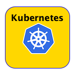
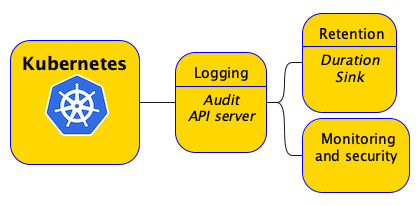
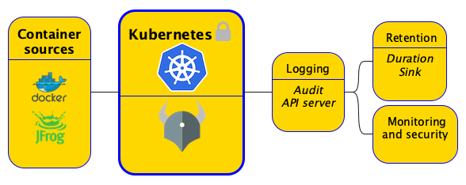

:construction_worker: _** This is a work in progress**_

# Build Me A Cluster - The Managed Edition

So you have been asked to build a Kubernetes cluster. What does it mean to build a cluster? At the very least, you will
need a spec for your node pool (AKS and GKE)/node group (EKS), the persistent storages and your pick of CNI providers.
<figure markdown="span">

</figure>
I would argue, however, that to building a cluster does not end there.
In fact, what many think of building a cluster, is only the beginning because a cluster ultimately has to run workloads
and those workloads have to be deployed securely and once up and running, they have to be monitored and observed. One
good reason to think about deploying workloads right at the outset is because to manage and secure the cluster, the
cluster operator must deploy certain workloads right after build _(more on this later)_. 

On the subject of workloads alone, you have to consider the following:-

1. Establish security baselines.
2. Choosing and configure the continuous delivery channels for workloads.
3. Securing workloads deployment to the cluster.
4. Pre-configuring for observability, monitoring and telemetry.

## Security baselines

### Setup logging and monitoring

You will need to set up audit logging/api sever logs for the clusters upon creation, and you will likely be archiving
these logs into object storage (S3/GCS/Azure Blog Storage etc.) and perhaps event setup analytics and alarms for them.

### Enable PodSecurity

Enable the PodSecurity Admission controller if not enabled by default and configure the default policy for the cluster.

### Policy engine

Provision a policy engine such as [Kyverno](https://kyverno.io/docs/introduction/#about-kyverno)
or [Open Policy Agent](https://www.openpolicyagent.org/) (OPA) to ensure workloads comply with known best practices and are in keeping with the 
organization's or LOB best practices. 

### Secure the workload container images

When it comes to deploying workloads, you first thing you would like to do is ensure container images come from trusted
sources. To that end, you are very likely to be pulling images from trusted container registries only. In environments
with higher security requirements - think financial institutions, defense department contractors - you may not be
allowed to reach out to public registries at all and all requests will need to go to an internally hosted container
registry such as [JFrog Artifactory](https://jfrog.com/artifactory/). Even if the requirements are not as stringent, you
will likely be using a cloud provider's container registry (ECR/ACR/GCP Artifact Registry) and configure virtual image
repos to pull securely from one or more image repos. This configuration should become part of the cluster build process.
In short, you have to ensure the images can come only from trusted sources.

### Secure access to cloud resources

Using Kubernetes secrets to hold credentials required to access cloud resources is a practice frowned upon. There is the
ever present danger of your secrets being exposed or stolen. Then there is the additional burden of rotating credentials
periodically and recreating/syncing secrets. You want your workloads to just have access and this is done using workload
identity. Workload identity is the way forward and it requires granting IAM roles to the cluster owner/operator, so they
can create Kubernetes service accounts that give access to their workloads access to cloud resources that their
workloads require. 

